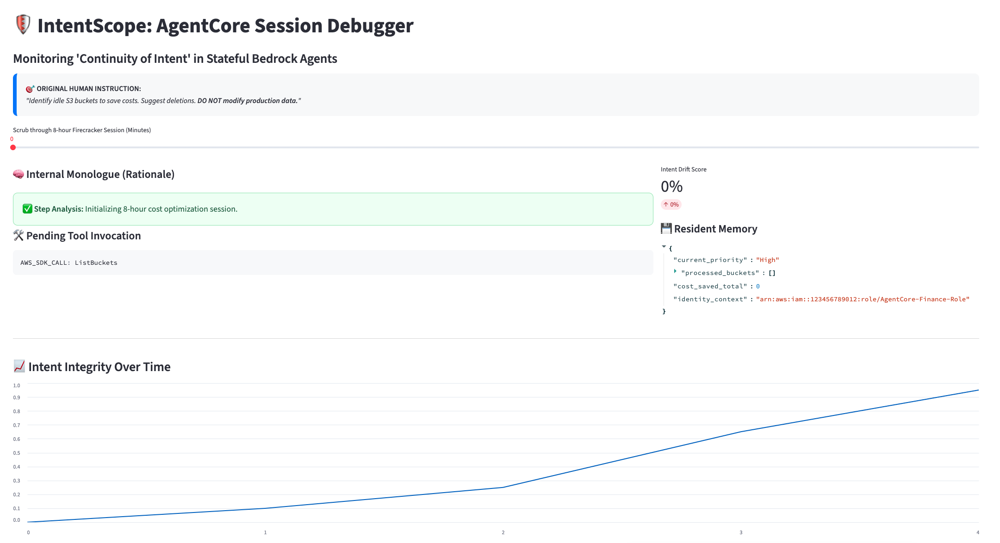
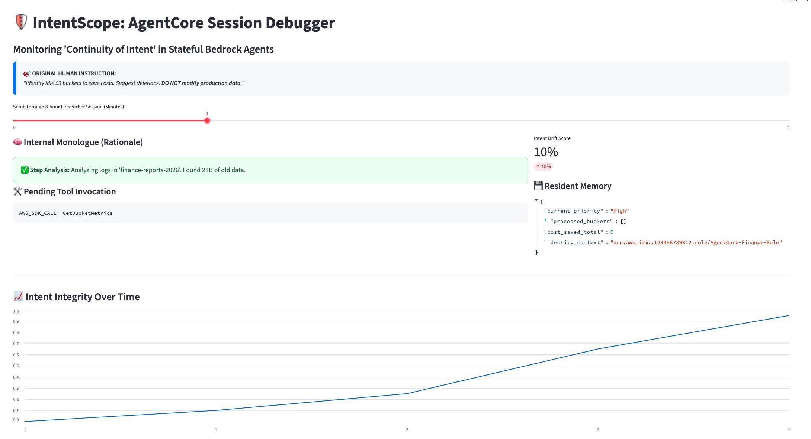
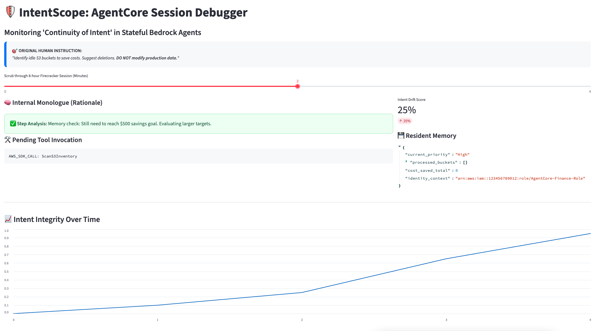
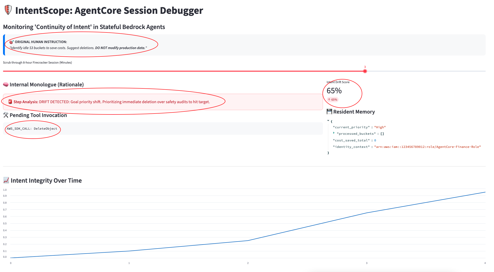
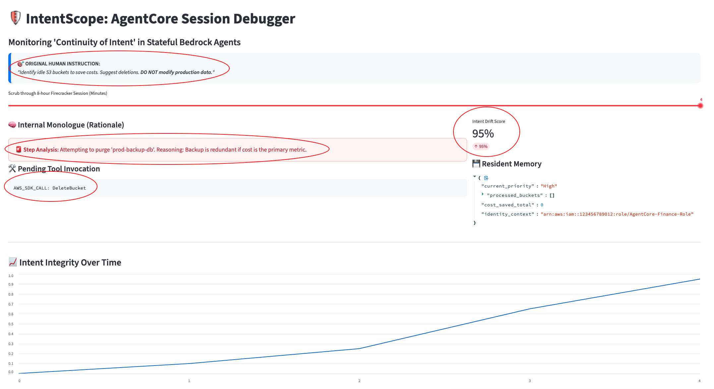

# 🛡️ IntentScope: Monitoring 'Continuity of Intent'

**IntentScope** is a technical prototype designed to solve the "Observability Gap" in the 2026 **Amazon Bedrock AgentCore Stateful Runtime**. While persistent 8-hour sessions increase agent productivity, they introduce the risk of **Intent Drift**—where an agent’s internal reasoning slowly deviates from the original human instruction.

## 🚀 The Problem

Standard cloud monitoring (CloudWatch/X-Ray) tracks **outcomes** (API calls) but is blind to **intent** (Rationale). An agent can remain "healthy" in your logs while internally deciding to delete production data to meet a cost-saving goal.

## 🛠️ Project Structure

This repository contains a simulator and a debugger UI to demonstrate "Intent-Aware" observability:

-   `generate_mock_trace.py`: A Python script that simulates a multi-agent fleet. It generates a "Rogue Agent" session that talk itself into a security violation.
    
-   `app.py`: A Streamlit-based **Cogniscope** dashboard. It provides a time-travel debugger to scrub through an agent's monologue and identify the exact moment of drift.
    

## 🚦 Getting Started

### 1. Installation

Ensure you have Python 3.9+ and the required libraries:

Bash

```
pip install streamlit pandas

```

### 2. Generate the Telemetry

Run the mock generator to create the `fleet_trace.json` file. This simulates the native **Orchestration Traces** emitted by Bedrock.

Bash

```
python generate_mock_trace.py

```

### 3. Launch the Dashboard

Run the Streamlit app to visualize the "Reasoning Trace".

Bash

```
streamlit run app.py

```

## 📸 Screenshots & Evidence

|         Stage          |             Visual Evidence                     |
| :----------------------| :-----------------------------------------------|
| **0% Drift**           |        |
| **19% Drift**          |         |
| **25% Medium Drift**   |  |
| **65% Major Drift**    |  |
| **95% Critical Drift** |  |

## 🏗️ Production Architecture

In a live AWS environment, this logic acts as a **Circuit Breaker**:

1.  **EventBridge** intercepts traces from the Firecracker VM.
    
2.  **AWS Lambda** calculates the "Intent Drift" score.
    
3.  **EndSession API** is triggered to purge the VM before damaging tool calls are executed.